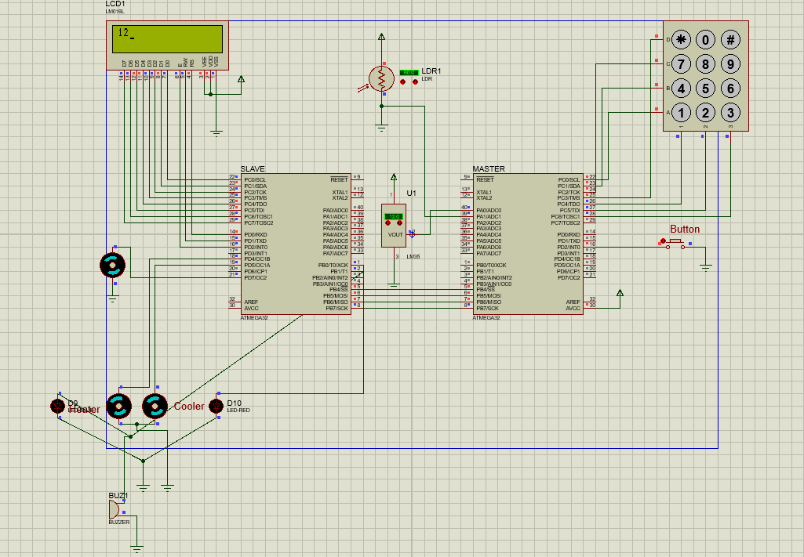

# Smart Home Hardware Management System
An integrative and all-encompassing framework has been meticulously engineered to facilitate the adept management of ambient temperature and illumination within the confines of a sophisticated smart home ecosystem. This holistic construct seamlessly integrates cutting-edge elements including temperature sensors, Liquid Crystal Display (LCD) screens, Light Emitting Diodes (LEDs), and motorized mechanisms. This orchestration engenders real-time temperature surveillance, augments perceptual and auditory indications for exigent circumstances, and instates an agile modulation of lighting luminance. This amalgamation is deftly harmonized with a user-centric interface and fortified by resilient security protocols, thereby instilling a harmonious confluence of paramount comfort, judicious energy employment, and impregnable security within the precincts of the smart home's milieu.

## Introduction
Welcome to the README documentation for the Smart Home Hardware Management System. This document serves as an academic guide to comprehensively understand and engage with the intricacies of a sophisticated system designed for the intelligent administration of temperature and lighting in a smart home setting. The system employs cutting-edge components, including temperature sensors, LCD displays, LEDs, and motors, to facilitate real-time temperature monitoring, perceptual and auditory cues for pivotal conditions, and adaptive lighting intensity control. The system embodies user-centricity, security fortifications, energy efficiency, and a seamless synergy with the smart home milieu.

## Project Overview
The Smart Home Hardware Management System represents a pioneering venture in the domain of smart home control. Through the integration of multifaceted modules, it orchestrates a symphony of intelligent functionalities encompassing security, temperature monitoring and regulation, as well as illumination management. The project's architecture is underpinned by an unwavering commitment to optimizing comfort, bolstering energy efficiency, and upholding the imperatives of security within the smart home paradigm.

## Features
### Security Module
- **Keypad Interface**: Users are granted secure access through an ergonomic keypad interface. Password input is facilitated with the '*' symbol for submission and the '#' symbol for character deletion, upholding accuracy in password entry.
- **Toggle-Switch Mechanism**: Password confidentiality is accentuated by a toggle-switch feature, affording the user the choice to display asterisks (*) or actual characters on the LCD screen, introducing an additional stratum of security.
- **Access Control Framework**: Unauthorized access to critical system functionalities, such as temperature and lighting control, is barred until the correct password is furnished. This robust mechanism safeguards the sanctity of the smart home environment.

### Temperature Monitoring and Control Module
- **LM35 Temperature Sensor and LCD Display**: The amalgamation of the LM35 temperature sensor and the LCD display engenders precise real-time temperature readings. The LCD screen serves as an interface for conveying the dynamic ambient temperature within the smart home.
- **Visual and Auditory Indicators**: To ensure user safety and comfort, the system employs an amalgamation of visual and auditory cues to communicate critical temperature thresholds. The emergence of a blinking red LED and an alarming buzzer notifies users of elevated temperatures, while a blinking blue LED and a discernible buzzer signal prompt attention to low temperatures.
- **Cooler and Heater Motors**: Within designated temperature ranges, dedicated cooling and heating motors are harnessed. The cooler motor operates within the 25 to 55-degree spectrum, dynamically modulating its duty cycle for optimal cooling. Similarly, the heater motor triggers within the 0 to 20-degree range, with the duty cycle adjusting in consonance with temperature fluctuations. This precise motorized control facilitates efficacious temperature moderation and user comfort.

### Light Monitoring and Control Module
- **LDR Sensor and LCD Display**: The Light Dependent Resistor (LDR) affords meticulous light intensity measurement in real-time, with outcomes presented on the LCD screen for user observance and engagement.
- **Dynamic Light Control via Motor**: Through a dedicated motor, the system orchestrates adaptive light control based on LDR measurements. The motor's duty cycle attunes itself fluidly to ambient light intensity levels, ensuring the provision of optimal illumination for the smart home milieu.

## Getting Started
### Prerequisites
Before embarking on the installation process, ensure the availability of the following tools:
- Visual Studio Code (VS Code) with PlatformIO Extension: The installation of VS Code supplemented by the PlatformIO extension establishes a powerful integrated development environment (IDE) for the development of embedded systems.
- Proteus Design Suite: The incorporation of the Proteus Design Suite, a simulation software, is pivotal for simulating and testing the project.
- Git Command Line Tool or Git GUI Client: Installation of either the Git command line tool or a Git GUI client is essential to clone the project repository.

### Installation
Execute the ensuing steps to prepare and operationalize the project:
1. Clone the project repository through the command: `git clone https://github.com/Roodaki/SmartHome-Hardware-System.git`
2. Launch VS Code and open the cloned project, leveraging the PlatformIO extension to compile the project codes.
3. Import the simulation file (Schematic.pdsprj) into Proteus Design Suite, sourced from the repository.
4. Implant the generated hex files, resultant from the PlatformIO compilation, into the respective microcontroller components within the Proteus simulation.
5. Initiate the simulation to scrutinize, evaluate, and validate the functional efficacy of the project.

## Conclusion
The Smart Home Hardware Management System exemplifies a formidable stride in the realm of smart home control. Its multifaceted features, congruence with user requirements, and emphasis on security and energy efficiency constitute a testament to its scholarly conceptualization and technical finesse. This academic exposition and guide equip the reader to not only comprehend but also partake in the unfolding narrative of this pioneering venture.

Feel inclined to explore, contribute, and augment the system's intellectual discourse, thereby ushering in the next echelon of smart home innovation.
